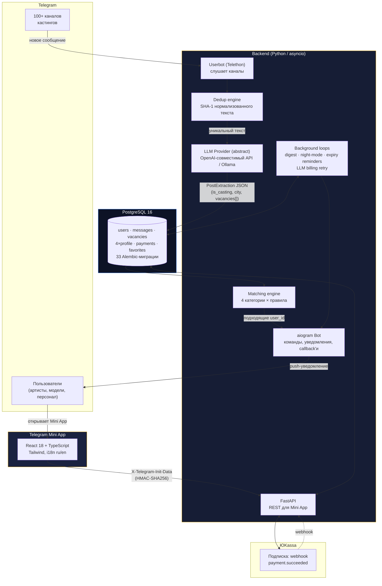
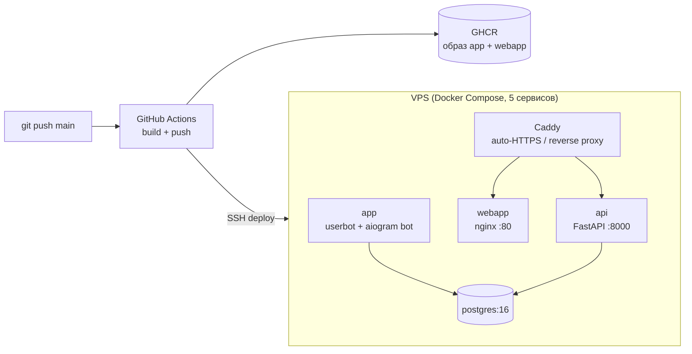

# 🎬 ModelPro — AI-платформа для кастинг-агентства в Telegram

[](https://www.python.org/)
[](https://fastapi.tiangolo.com/)
[](https://docs.aiogram.dev/)
[](https://docs.telethon.dev/)
[](https://www.postgresql.org/)
[](https://react.dev/)
[](https://www.typescriptlang.org/)
[](https://www.docker.com/)
[](https://github.com/sankficeba/model_pro/actions/workflows/deploy.yml)

**ModelPro** — production-сервис, который автоматически вычитывает сотни кастинговых
Telegram-каналов, с помощью LLM превращает неструктурированные объявления в
структурированные вакансии и доставляет их персонально каждому актёру, модели,
event-сотруднику или разнорабочему — только те кастинги, под которые он
реально подходит по полу, возрасту, городу, ставке, антропометрии и опыту.

Продукт живёт как Telegram-бот **[@ModelProAgency_bot](https://t.me/ModelProAgency_bot)**
с полноценным **Mini App** (React) для заполнения анкеты, подписки и управления
уведомлениями — https://modelpro.agency.

> Репозиторий — это весь бэкенд продукта: userbot-парсер, LLM-пайплайн,
> движок матчинга, aiogram-бот, FastAPI backend для Mini App, платежи,
> админ-инструменты и полный CI/CD на VPS.

---

## Содержание

- [Проблема и решение](#-проблема-и-решение)
- [Архитектура](#-архитектура)
- [Ключевые возможности](#-ключевые-возможности)
- [Технологический стек](#-технологический-стек)
- [Модель данных](#-модель-данных)
- [Инженерные решения, которыми я горжусь](#-инженерные-решения-которыми-я-горжусь)
- [Структура репозитория](#-структура-репозитория)
- [Запуск проекта](#-запуск-проекта)
- [Тесты](#-тесты)
- [CI/CD и продакшен](#-cicd-и-продакшен)
- [Метрики проекта](#-метрики-проекта)
- [Возможные развития](#-возможные-развития)

---

## 🎯 Проблема и решение

Кастинги в шоу-бизнесе и event-индустрии публикуются десятками разрозненных
Telegram-каналов: без единого формата, без фильтрации по городу/полу/возрасту,
с постоянными репостами одного и того же объявления в десятки чатов.
Человеку физически невозможно вручную мониторить всё это, не утопая в шуме.

**ModelPro решает это в три шага:**

1. **Слушает** десятки каналов через Telegram-аккаунт (userbot), а не через
   Bot API — это даёт доступ к приватным чатам и полной истории сообщений.
2. **Понимает** каждый пост через LLM: извлекает из свободного текста
   структуру — категорию, город, ставку, несколько вакансий в одном посте,
   требования к полу/возрасту/росту/типажу — и валидирует её Pydantic-схемой.
3. **Доставляет** точечно: у каждого пользователя своя анкета (одна из 4 категорий),
   и вакансия долетает только тем, кому подходит — мгновенно, вечерним дайджестом
   или «до утра», по выбору пользователя.

---

## 🏗 Архитектура



### Продакшен-инфраструктура



Push в `main` → сборка образов → GHCR → SSH на VPS → `docker compose pull && up -d`
→ `caddy reload`. Полностью автоматический деплой без ручных шагов, откат — заменой
тега образа на `sha-<commit>` (см. [DEPLOY.md](DEPLOY.md)).

---

## ✨ Ключевые возможности

### 🔎 Парсинг и извлечение данных

- **Userbot на Telethon**, а не Bot API — читает публичные и приватные каналы
  (по username или по `tg_chat_id` для приватных), включая полный текст без
  ограничений Bot API.
- **LLM-экстракция** структурированных данных из свободного текста поста
  русским system-промптом (~800 строк): категория, город, ставка, несколько
  вакансий в одном объявлении (`role_types`, пол, возрастной диапазон, рост,
  этничность, тип фигуры, цвет/длина волос, дата смены) — всё валидируется
  Pydantic-схемой (`PostExtraction` / `VacancyExtraction`), при невалидном
  JSON пост просто помечается `confidence=0.0`, а не роняет пайплайн.
- **Provider-agnostic LLM-слой**: абстрактный `LLMProvider` с реализациями
  под любой OpenAI-совместимый API (OpenAI, DeepSeek — просто смена
  `OPENAI_BASE_URL`/`OPENAI_MODEL` без единой строчки кода) и под локальный
  **Ollama**, плюс `stub`-провайдер на regex-эвристиках для детерминированных
  unit-тестов без сетевых вызовов.
- **Дедупликация репостов**: один и тот же кастинг форвардится в десятки
  каналов — текст нормализуется (убираются forward-заголовки, t.me-ссылки,
  упоминания, эмодзи, схлопывается whitespace) и хэшируется в SHA-1;
  LLM вызывается только для одной канонической копии, дубликаты привязываются
  к ней без единого лишнего API-запроса.

### 🎯 Персональный матчинг

- **4 независимые категории** пользователей — «Творческие позиции», «Event-персонал»,
  «Разнорабочие», «Администрирование» — каждая со своей анкетой (30+ полей:
  антропометрия, типаж, ставка, готовность к разъездам, портфолио, опыт) и
  собственным набором правил матчинга.
- Один пост может содержать **несколько вакансий разных категорий** —
  диспетчер матчинга резолвит эффективную категорию для каждой вакансии
  отдельно (`vacancy.category` переопределяет `post.category` для гибрид-постов).
- Правила матчинга: пересечение возрастных диапазонов, город + флаг
  готовности к разъездам, минимальная ставка, пересечение множеств
  (этничность/типаж/навыки), диапазон роста — каждое правило включается,
  только если LLM реально извлёк соответствующее требование.

### 📬 Гибкая доставка уведомлений

- **Instant** — мгновенно, как только пришло совпадение.
- **Digest** — накопление в очередь, пользователь листает вручную кнопкой
  «Следующее» из бота или Mini App.
- **Night-mode** — уведомления копятся в заданный ночной диапазон часов (MSK)
  и утром приходит одна сводка «За ночь — N кастингов».
- **Daily digest push** — опциональная ежедневная плашка-напоминание в
  заданный час.
- Каждый режим — отдельный фоновый `asyncio`-луп, работающий параллельно с
  ботом и юзерботом через `asyncio.gather` в `main.py`.

### 📱 Telegram Mini App (React + TypeScript)

- Многошаговые формы анкеты под каждую категорию с автосохранением черновика,
  live-подсказками (autocomplete по ранее введённым значениям того же
  пользователя в других анкетах) и прогресс-баром заполненности.
- Избранное с bulk-загрузкой (оптимизация N+1: список из 28 избранных
  ускорен с ~10–15 c до ~200 мс за счёт трёх batched-запросов вместо
  N×3 отдельных).
- Экран подписки с 4 тарифами и скидками, чёрный список слов-стоп-фильтров,
  настройки доставки, форма «Предложить канал» и «Сообщить о проблеме» —
  обе с прямой эскалацией администраторам в Telegram с inline-кнопками
  принятия решения.
- Отдельная админ-панель (статистика, широковещательная рассылка с
  демографическими фильтрами, модерация каналов и профилей) — доступ
  проверяется по `ADMIN_IDS` из initData.
- Полная **i18n ru/en**, тёмная премиальная тема (navy + gold), лендинг
  на отдельном домене с собственной дизайн-системой (Playfair Display + Inter).

### 💳 Подписки и платежи

- Интеграция с **ЮKassa**: 4 тарифа (1/3/6/12 месяцев со скидками),
  триальный период, идемпотентные платежи (`idempotency_key`), webhook
  `payment.succeeded` продлевает подписку и уведомляет пользователя в чате.
- Автоматические напоминания об истечении подписки на 3 стадиях
  (2 дня / 1 день / 3 часа), каждая отправляется ровно один раз.
- Защита webhook shared-secret токеном в query-параметре, сверка
  `payment_id` с БД перед обработкой события.

### 🔐 Безопасность и админ-инструменты

- Аутентификация Mini App по официальной схеме Telegram —
  HMAC-SHA256 над `initData` с секретом, производным от токена бота,
  плюс проверка свежести (`auth_date`, TTL 24 ч).
- Кастомные Premium-эмодзи на inline-кнопках (`icon_custom_emoji_id`,
  Bot API 9.4+) для визуально узнаваемого бренд-интерфейса бота.
- Управление списком каналов прямо из бота (`/addchannel`, `/removechannel`,
  `/channels`) с ретраем `JoinChannelRequest` для не принятых ещё приглашений.
- Широковещательная рассылка с фильтрами по категории/возрасту/росту/ФИО.

---

## 🧰 Технологический стек

| Слой | Технологии |
|---|---|
| **Telegram-интеграция** | Telethon 1.36 (userbot), aiogram 3.13 (bot API), Bot API 9.4 custom-emoji |
| **Backend API** | FastAPI 0.115, Uvicorn, Pydantic v2, HMAC-аутентификация Mini App |
| **LLM** | OpenAI SDK 1.54 (OpenAI-совместимый интерфейс: OpenAI / DeepSeek), Ollama — provider-agnostic абстракция + factory |
| **База данных** | PostgreSQL 16, SQLAlchemy 2.0 (async, `Mapped`/`mapped_column`), asyncpg, Alembic (33 миграции) |
| **Платежи** | YooKassa SDK, webhook-driven продление подписки |
| **Frontend (Mini App)** | React 18, TypeScript 5.6, Vite 5, Tailwind CSS, lucide-react |
| **Инфраструктура** | Docker, Docker Compose (5 сервисов), Caddy 2 (авто-HTTPS/Let's Encrypt), nginx (webapp) |
| **CI/CD** | GitHub Actions → GHCR → SSH-деплой на VPS, откат по `sha-<commit>` тегу |
| **Тестирование** | pytest + pytest-asyncio, детерминированный `stub`-LLM-провайдер, 15 тестовых модулей |
| **Логирование** | loguru |

---

## 🗄 Модель данных

PostgreSQL-схема выросла на 33 Alembic-миграциях от MVP до полноценного
мультикатегорийного продукта. Ключевые таблицы:

| Таблица | Назначение |
|---|---|
| `users` | Профиль Telegram-пользователя: доставка, ночной режим, подписка, блэклист слов, язык |
| `channels` | Мониторимые каналы (публичные по `username` или приватные по `tg_chat_id`) |
| `messages` | Сырые + извлечённые LLM-поля поста, дедуп (`text_hash`, `canonical_message_id`), `llm_retry_needed` |
| `vacancies` | 0..N вакансий на один `message` — своя категория, требования, `idx` для стабильного порядка |
| `creative_profile` / `event_profile` / `general_profile` / `admin_profile` | Анкеты по 4 категориям, 1:1 с пользователем |
| `user_category_subscription` | На какие категории подписан пользователь (multi-row, `enabled` — переключатель) |
| `notifications` / `pending_notifications` | Лог отправленных уведомлений + очередь для digest/night-режимов |
| `payments` | Платежи ЮKassa: `idempotency_key`, статус `pending → succeeded` |
| `favorites` / `problems` | Избранные вакансии, тикеты поддержки |

Все ARRAY/JSONB-поля (типажи, навыки, множественный выбор в анкетах)
используют нативные Postgres-типы `ARRAY(Text)` / `JSONB` — без сериализации
в строку и без отдельных many-to-many таблиц там, где это осознанно избыточно.

---

## 🛠 Инженерные решения, которыми я горжусь

<details>
<summary><b>1. Возрастной cutoff в retry-очереди LLM спас пользователей от спама «протухшими» кастингами</b></summary>

<br>

При временном отказе LLM-провайдера (закончился баланс) сообщения помечались
`llm_retry_needed=true` и обрабатывались в фоновом лупе каждые 5 минут батчами
по 50 штук **в порядке получения** — старые вперёд. При простое в несколько
дней очередь выросла до **15 057 сообщений**, и после восстановления баланса
пользователям начали приходить уведомления о кастингах недельной давности,
которые уже закрылись.

**Решение**: `discard_stale_llm_retry()` в начале каждого цикла ретрая
отбрасывает сообщения старше `LLM_RETRY_MAX_AGE_HOURS` (по умолчанию 48ч) —
**без** вызова LLM и **без** уведомления пользователя, кастинг всё равно
неактуален. Очередь очистилась с ~15 000 до разумного размера за один цикл,
живые уведомления снова стали приходить мгновенно.
</details>

<details>
<summary><b>2. Billing-ошибки разных LLM-провайдеров не унифицированы по HTTP-коду — и это едва не привело к тихой потере сообщений</b></summary>

<br>

OpenAI сигнализирует «кончились деньги» кодом `429` (`RateLimitError` в SDK).
DeepSeek — совсем другим кодом, `402 Insufficient Balance` (`APIStatusError`).
Изначально ловился только 429: при переключении на DeepSeek billing-ошибка
не распознавалась как `LLMBillingError`, попадала в общий `except Exception`,
сообщение помечалось `confidence=0.0` и **терялось безвозвратно** — без
ретрая и без алерта администраторам.

**Решение**: расширил обработку в `OpenAIProvider._complete_json` — ловим
`APIStatusError` и явно проверяем `status_code == 402`, приравнивая его к
billing-исключению наравне с 429. Теперь billing-сбой любого
OpenAI-совместимого провайдера корректно уходит в retry-очередь и триггерит
дебаунсед (раз в час) алерт администраторам в Telegram.
</details>

<details>
<summary><b>3. N+1-запросы в списке избранного: 10–15 секунд → ~200 мс</b></summary>

<br>

Рендер списка избранного дёргал БД по 3 запроса **на каждую** карточку
(сообщение, вакансии, канал) — с 28 сохранёнными вакансиями это превращалось
в 84+ последовательных round-trip'а и 10–15 секунд ожидания в Mini App.

**Решение**: переписал `GET /api/favorites` на bulk-загрузку — три запроса
на **весь список** (`message_id IN (...)`, `message_id IN (...)`,
`tg_chat_id IN (...)`) с последующей склейкой в памяти по словарям. Добавил
пофазовое логирование таймингов (`prune/list/bulk/render`) прямо в проде для
дальнейшей диагностики без дополнительного APM.
</details>

<details>
<summary><b>4. Дедуп репостов без внешней очереди/Redis</b></summary>

<br>

Один и тот же кастинг может репоститься в десятки каналов за минуты. Гонять
каждую копию через платный LLM-вызов — дорого и медленно, а наивное
сравнение текста ломается на forward-заголовках, разных ссылках-подписях и
эмодзи, которые администраторы каналов добавляют вручную.

**Решение**: лёгкий нормализатор (`db/dedup.py`) — regex вычищает
`Forwarded from ...`, `t.me/`-ссылки, `@упоминания` и Unicode-эмодзи, схлопывает
пробелы и приводит к `casefold()`, затем берётся SHA-1. LLM вызывается только
для первой (канонической) копии; все дубликаты сразу привязываются к её
результату матчинга — без Redis, без очереди задач, чистым SQL-UNIQUE по хэшу.
</details>

<details>
<summary><b>5. Гибрид-посты с несколькими категориями в одном объявлении</b></summary>

<br>

Кастинговые агентства часто публикуют один пост сразу с несколькими ролями
разных типов («нужны актёры на роль + хостес на мероприятие»). Жёсткая
привязка «одна категория — один пост» либо теряла часть вакансий, либо
рассылала их не той аудитории.

**Решение**: категория резолвится **на уровне каждой вакансии**, а не поста —
`vacancy.category` опционально переопределяет доминирующую `post.category`.
Диспетчер матчинга (`find_matching_vacancies`) кэширует загруженные профили
по категории (чтобы не грузить дважды профили одной категории для двух
вакансий одного поста) и прогоняет каждую вакансию через свой matcher.
</details>

---

## 📂 Структура репозитория

```
model_pro/
├── main.py                    # точка входа: userbot + bot + 4 фоновых лупа параллельно
├── config.py                  # pydantic-settings, единый источник конфигурации из .env
│
├── userbot/
│   └── client.py               # Telethon: слушает каналы, дедуп, вызов LLM, форматирование и рассылка
├── bot/
│   ├── handlers.py             # aiogram: команды, callback-хендлеры, digest-навигация
│   ├── keyboards.py            # inline-клавиатуры с Premium custom-emoji
│   ├── response.py             # генерация текста отклика на вакансию из профиля
│   └── i18n.py                 # ru/en локализация бота
│
├── llm/
│   ├── base.py                  # абстрактный LLMProvider + system-промпт извлечения (~800 строк)
│   ├── openai_provider.py       # OpenAI-совместимый HTTP API (OpenAI / DeepSeek / любой compatible)
│   ├── ollama_provider.py       # локальная модель через Ollama
│   ├── stub_provider.py         # regex-заглушка для тестов без сети
│   ├── normalize.py             # нормализация категорий/дат из ответа LLM
│   └── factory.py               # выбор провайдера по LLM_PROVIDER
│
├── db/
│   ├── models.py                 # SQLAlchemy 2.0 declarative-модели (users, messages, vacancies, ...)
│   ├── repository.py             # вся работа с БД (2300+ строк) — CRUD, digest-очереди, статистика
│   ├── matching.py                # per-category движок матчинга + диспетчер
│   ├── dedup.py                   # нормализация текста + SHA-1 фингерпринт
│   └── session.py                 # async engine/session factory
│
├── api/
│   ├── main.py                   # FastAPI-приложение: профили, подписки, избранное, платежи
│   ├── admin.py                  # админ-роуты: статистика, рассылка, модерация
│   ├── auth.py                   # HMAC-валидация Telegram initData
│   ├── schemas.py                # Pydantic-схемы запросов/ответов API
│   ├── plans.py                  # тарифы подписки
│   └── reference_data.py         # справочники для Mini App (типы ролей, навыки, города, ...)
│
├── payments/
│   └── yookassa_client.py        # создание платежей, парсинг webhook
│
├── models/
│   └── schemas.py                # PostExtraction / VacancyExtraction — контракт LLM ↔ система
│
├── webapp/                       # Telegram Mini App
│   └── src/
│       ├── forms/                 # многошаговые формы анкет по 4 категориям
│       ├── components/            # экраны: избранное, подписка, админ-панель, блэклист, ...
│       ├── fields/                # переиспользуемые поля с autocomplete/валидацией
│       ├── contexts/               # SuggestionsContext — подсказки по истории ввода
│       ├── LandingPage.tsx         # маркетинговый лендинг (отдельная дизайн-система)
│       └── i18n.tsx                # ru/en для Mini App
│
├── migrations/versions/          # 33 Alembic-миграции — вся эволюция схемы
├── tests/                        # 15 тестовых модулей (pytest + pytest-asyncio)
├── scripts/                       # debug_extract.py, reprocess_message.py — ручной прогон LLM
│
├── Dockerfile · entrypoint.sh     # единый образ под режимы `bot` и `api`
├── docker-compose.yml             # локальная разработка
├── docker-compose.prod.yml        # прод: app + api + webapp + caddy + postgres
├── caddy/Caddyfile                # reverse proxy + авто-HTTPS
└── .github/workflows/deploy.yml   # CI/CD: build → GHCR → SSH-деплой
```

---

## 🚀 Запуск проекта

### Через Docker Compose (рекомендуется)

```bash
git clone git@github.com:sankficeba/model_pro.git
cd model_pro
cp .env.example .env      # заполнить TG_API_ID/HASH, BOT_TOKEN, каналы, LLM-ключ

docker compose up --build
```

При первом запуске Telethon запросит код подтверждения из Telegram —
он вводится прямо в лог контейнера (`docker attach tg_parser_app`).
Сессия сохраняется в `./sessions/` (volume) — не удалять, иначе авторизация
слетит.

### Локально без Docker

```bash
python -m venv .venv && source .venv/bin/activate   # Windows: .venv\Scripts\activate
pip install -r requirements.txt
cp .env.example .env      # затем отредактировать
alembic upgrade head       # накатить схему на локальный Postgres
python main.py             # userbot + bot + все фоновые лупы
```

Frontend (Mini App) разрабатывается отдельно:

```bash
cd webapp
npm install
npm run dev
```

### Переключение LLM-провайдера

Полностью через `.env`, без единой строчки кода:

```bash
LLM_PROVIDER=openai
OPENAI_API_KEY=sk-...
OPENAI_MODEL=gpt-4o-mini
OPENAI_BASE_URL=https://api.openai.com/v1   # смена на DeepSeek — только это поле
```

Добавить нового provider'а (Anthropic, OpenRouter, ...) — унаследовать
`LLMProvider` в `llm/`, зарегистрировать в `llm/factory.py`.

---

## ✅ Тесты

```bash
pytest tests/ -v
```

15 тестовых модулей покрывают: матчинг по всем 4 категориям (включая
гибрид-посты и edge-кейсы диспетчера), нормализацию LLM-ответов, дедуп,
autocomplete-подсказки, форматирование уведомлений, Pydantic-схемы и
`stub`-LLM-провайдер — вся логика матчинга и извлечения тестируется
**детерминированно, без реальных сетевых вызовов к LLM**.

---

## 🔄 CI/CD и продакшен

Push в `main` → **GitHub Actions** параллельно собирает 2 Docker-образа
(backend + Mini App) → пушит в **GHCR** → по SSH разворачивает на VPS через
`docker compose pull && up -d --remove-orphans` → **Caddy** перечитывает
конфиг. Полный пайплайн без ручных шагов, откат — заменой `IMAGE` на тег
`sha-<commit>`.

Продакшен — 5 Docker-контейнеров за одним `docker-compose.prod.yml`:
`app` (userbot + bot), `api` (FastAPI), `webapp` (nginx + статика React),
`caddy` (reverse proxy + авто-HTTPS от Let's Encrypt), `postgres`.

Подробная пошаговая инструкция разворачивания с нуля (DNS, firewall,
секреты GitHub Actions, первичная авторизация Telethon, откат, troubleshooting)
— в [DEPLOY.md](DEPLOY.md).

---

## 📊 Метрики проекта

| | |
|---|---|
| Python-код (без миграций/тестов) | ~9 000 строк, 90 файлов |
| Frontend (TypeScript/TSX) | ~6 600 строк |
| Alembic-миграций | 33 |
| Тестовых модулей | 15 |
| API-эндпоинтов (FastAPI) | 40+ |
| Категорий пользователей / профилей | 4 |
| Docker-сервисов в проде | 5 |
| Фоновых `asyncio`-лупов | 5 (bot, digest, night-mode, expiry-reminders, LLM-retry) |

---

## 🗺 Возможные развития

- Вынос LLM-обработки в отдельную очередь задач (Celery/RQ) для горизонтального
  масштабирования при росте числа каналов.
- Метрики Prometheus + Grafana поверх текущих structured-логов (loguru).
- A/B-сравнение качества извлечения между провайдерами на исторических данных
  (заготовка есть в `scripts/debug_extract.py` / `scripts/reprocess_message.py`).

---

<p align="center">
  <sub>Solo-разработка: продукт, бэкенд, LLM-пайплайн, БД, Mini App, инфраструктура и CI/CD.</sub>
</p>
